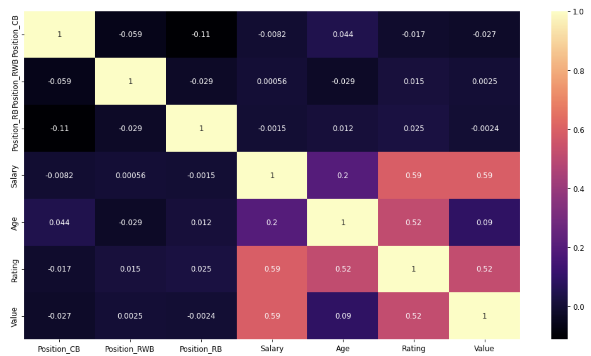

# FIFA21 Mini Project

## Project Overview and Objective:
For the first mini project we were given a data set from FIFA21, my first proposal was to analyze the relationship between the Instagram followers and the market value of the player as my theory was that these days with the online presence, the market value from a player can be affected positively. But after a first analysis of the dataset, this info was not provided. 
To simplify the objective with the available data I kept the Market Value as my target value, and my goal was to analyze how the variables such as salary, age, and overall rating of the player affect its variability.

I have used 3 notebooks to analyze different regression models.

**First Model** -> Only use Age, Salary, Overall Rating, and Market Value as the dependent one  
**Second Model** -> Only use Age, Salary, Overall Rating, Club and Market Value as the dependent one.  
**Third Model** -> Only use Age, Salary, Overall Rating, Position and Market Value as the dependent one.

After the first approach, I have chosen the ***third model*** to analyze how the variables impact the market value

### Data description:
The data set provided was **fifa21_male2.csv**  
Details about the dataset can be found here as well [https://www.kaggle.com/ekrembayar/fifa-21-complete-player-dataset?select=fifa21_male2.csv]

## Third model
I have selected the variables “Age”, “Salary”, “Position”, “Rating” and “Value” and my main objective was to check how these(“Age”, “Salary”, “Position”, “Rating”) affect the “Value”

## Cleaning
For the data cleaning, I have applied the following steps:
1. Column names standardization  
2. Check for NaN values 
3. Change column types to numerical and restructure the “Salary” and “Value” columns

## Graphs
### Distribution

Here we can see that the distribution for “Age” and “Rating”  is concentrated and not for “Salary” and “Value” due to the outliers, but for this case, as i wanted to analyze the Market Value i didn't delete them
### Positions distribution

As this is a categorical variable I have analyzed it separately to check the distribution of player's positions
### Pairplot

Here to check the variable relationships

## Model 
To apply the model I have divided the set into categorical and numerical variables.     
For the numerical subset, I have applied the normalization and for the categorical subset, I have created the dummies.  
Once both subsets were created I concatenated them and checked the correlation matrix

#### Model application results
After assigning the “Value” as Y and dropping this variable from axis 1 for the X i have applied the model

- ### r2: 0.3827721716791408
- ### mse: 0.0009292326547329517
- ### rmse: 0.030483317646426738
## Conclusions
As the number of observations is high and the number of variables is short I have decided to drop the P Values with more than 0,1 and apply the model again.

### Second model after drop the high P Values 

In this case, we only have 3 players' positions and the same numerical ones.
After this, I have checked again the correlation matrix 
### New correlation 

### Second model results

- ### r2: 0.3839032397766323
- ### mse: 0.0009275298387504398
- ### rmse: 0.030455374546218272

## Final conclusions
- When the age increases the market value tends to decrease
- When the salary and rating increase the market value tends to increase
- Some positions interfere with the market value increasing but it's not significative
- After trying the model also with only numerical and club variables I have reached the conclusion that there are other conditions to predict the market value of a player and it will be interesting to analyze their presence in the media 
